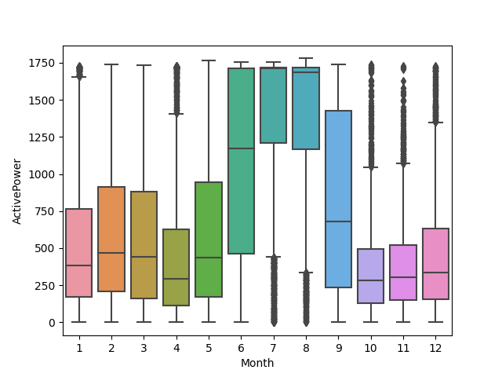
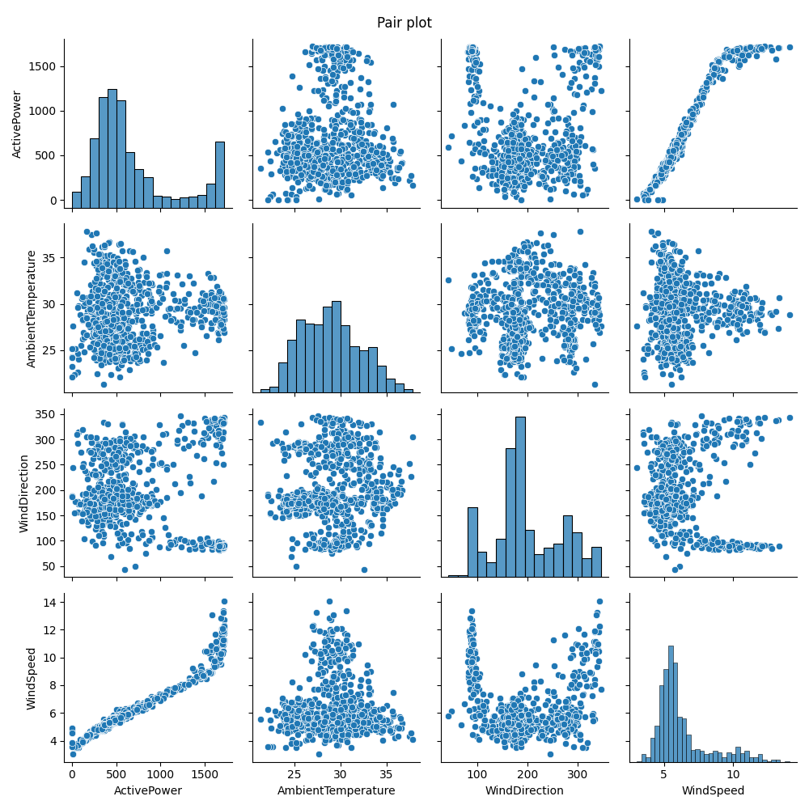
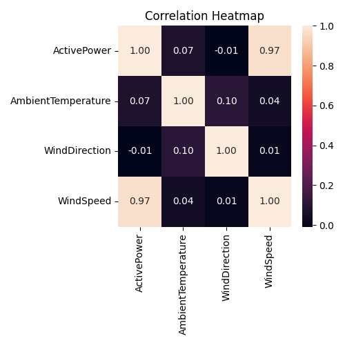
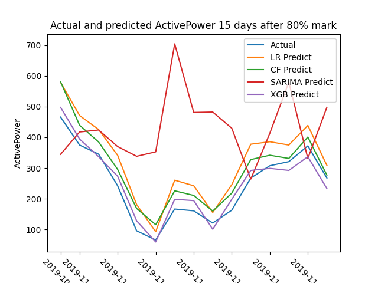
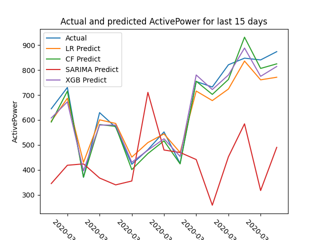

# Forecasting Power Generation From A Wind Turbine

## Table of Contents

<ul>
	<li>Overview</li>
	<li>Data</li>
	<li>Models</li>
	<li>Results</li>
</ul>

## Overview

This project analyzes and creates predictive models for a dataset of wind power generation. This dataset represents several years of data points taken every 10 minutes from January 2018 to March 2020. These data points include information on power generation, internal part temperatures, wind speed, wind direction, etc. There are many missing values in the dataset.

The dataset came with the suggested goal of predicting power output 15 days ahead of known/trained data.

I will explore and clean the dataset before applying a variety of techniques to the task including a baseline linear regression, a curve-fit based on an observed relationship between a predictor and the output, a SARIMA model, and finish off with using the XGBoost algorithm of boosted trees.

The best models achieved a mean absolute percentage error of approximately 5% on unseen data. 

This report contains the key details of the project. The full working notebook can be found in ForecastingWindPower.ipynb.

### Keywords

feature selection, forecasting, regression, SARIMA, XGBoost

## Data

This data contains 118224 measurements from a single wind turbine at 10-minute intervals from January 2018 to March 2020. These data points include information on power generation, internal part temperatures and positions, wind speed, wind direction, etc. 

The features of this dataset are as follows.

| Column Name | Column Description | Column Value Type |
|---|---|---|
| Index | Date and time of recording | Datetime |
| ActivePower  | Power (kW) produced by the turbine  | Continuous number |
| AmbientTemperature | Air temperature | Continuous number |
| BearingShaftTemperature | Internal part temperature | Continuous number |
| Blade1PitchAngle | Angle (degrees) of a blade of the turbine | Continuous number in \[0,360\] |
| Blade2PitchAngle | Angle (degrees) of a blade of the turbine | Continuous in \[0,360\] |
| Blade3PitchAngle | Angle (degrees) of a blade of the turbine | Continuous in \[0,360\] |
| ControlBoxTemperature | Internal part temperature | Continuous number |
| GearboxBearing Temperature | Internal part temperature | Continuous number |
| GearboxOilTemperature | Internal part temperature | Continuous number |
| GeneratorRPM | Internal part RPM | Continuous number |
| GeneratorWinding1 Temperature | Internal part temperature | Continuous number |
| GeneratorWinding2 Temperature | Internal part temperature | Continuous number |
| HubTemperature | Internal part temperature | Continuous number |
| MainBoxTemperature | Internal part temperature | Continuous number |
| NacellePosition | Angle (degrees) of nacelle (body) of turbine | Continuous in \[0,360\] |
| ReactivePower | Power fed into turbine | Continuous number |
| RotorRPM | Internal part RPM | Continuous number |
| TurbineStatus | Code representing maintenance status | Integer code |
| WTG | Unclear | "G01" only value|
| WindDirection | Angle (degrees) of incoming wind | Continuous number in \[0,360\] |
| WindSpeed | Speed of wind | Continuous number |

As this project focuses on forecasting power generation, we will largely disregard features which cannot be known or predicted ahead of time. Thus, we will focus only on data which could be known potentially days ahead of time. Many of these data points are purely reactive to the state of the weather around the wind turbine, so we will drop them. We will retain the date and time, the power generation, and the data points which can obtained from weather forecasts. This leaves us with the following data features.

| Column Name | Column Description | Column Value Type |
|---|---|---|
| Index | Date and time of recording | Datetime |
| ActivePower  | Power produced by the turbine  | Continuous number |
| AmbientTemperature | Air temperature | Continuous number |
| WindDirection | Angle (degrees) of incoming wind | Continuous number in \[0,360\] |
| WindSpeed | Speed of wind | Continuous number |

We then drop all 15644 rows which contain ActivePower values less than 0, as negative power cannot be generated. We assume these must be errors. 

This dataset has a significant amount of missing values. We will drop all remaining rows with missing values, leaving us with 57183 entries.

Finally, as the dataset of measurements every 10 minutes is quite noisy and the target is to forecast 15 days ahead of time, let's use daily averages of the data. This leaves us with 742 days of data.

### Visualizing the data

#### Values over time

We can see that ActivePower tends to stick within the range of approximately 250-750kW, except in the summers when there is a significant jump to 1500-1750kW. 

Looking at seasonal timeframes, we see that the power output tends to peak in the afternoon, 1pm to 6pm. We can also see more detail into the monthly trends, with the summers having significantly higher power output than other times of year. Note that these two plots in particular do not consider daily averages.

Let's get a feel for the weather variables. 

We see the expected change in AmbientTemperature as the months go on, without much surprise. WindDirection is a lot less noisy than I would have expected and interestingly does not follow a yearly pattern, the difference between values of WindDirection across July's are the most noticeable. WindSpeed tends to follow the same trend as ActivePower, which is to be expected. We will explore the relationship between WindSpeed and ActivePower further. 

#### Values against each other

The pair plot shows that there is essentially only one weather feature remotely correlated with ActivePower, WindSpeed, and the correlation is quite strong. The ActivePower-WindSpeed plotshows what is vaguely a sigmoid function, stretched and shifted. 

The correlation plot verifies low correlation between AmbientTemperature/WindDirection and ActivePower, and the very high correlation between WindSpeed and ActivePower.

Likely WindSpeed will be the only major factor in determining the power output, but it is possible the others have some effect. We will see this in our modeling tests.

## Models 

We will test with a range of models including a linear regression baseline model, a curve-fit model, a SARIMA model, and an XGBoost model. Performance of the models is considered in the following section [Results (link)](#Results).

### Preparation

First, we normalize the input values via standard normalization,

$$ x = \frac{x-mean(x)}{std(x)}. $$

### Train-Test Splits

We split the data into two different sets of training and test data for validation purposes. The first set's training data contains the first 80% of the data and the test data contains the following 15 days. The second set's training data contains the entire dataset minus the last 15 days and the test data contains the last 15 days. These sets are nicknamed "80" and "All-15". Details are found in the following table, and a visualization of these sets can be found in the following figure.

| Set nickname | Train or test | Index start | Index end |
|---|---|---|
| 80% | Train | 0 | 592 |
| 80% | Test | 593 | 607 |
| All-15  | Train  | 0 | 726 |
| All-15  | Test  | 727 | 741 |

### Linear Regreession (LR) Baseline Model

Both linear regression models produced p-values indicating all three input variables are significant. 

### Curve-Fit (CF) Model

This model exclusively considers the sigmoid-curve relationship between WindSpeed and ActivePower. We take the sigmoid curve, 

$$(1+e^{-x})^{-1},$$

and add in some new parameters,

$$a = \text{Vertical shift parameter},$$ 

$$b = \text{Vertical stretch parameter},$$

$$c = \text{Horizontal stretch parameter},$$

$$d = \text{Horizontal shift parameter},$$ 

to form a new curve to which we can fit our data,

$$a + b(1+e^{-(cx+d)})^{-1}.$$

### SARIMA Model

The SARIMA model exclusively considers historical values of daily mean ActivePower. First, we use the Augmented Dickey-Fuller test which provided a p-value of 0.004, which is less than 0.05, so the series is stationary. We used the the library pmdarima's auto_arima function to determine optimal p,q,P,Q parameters (where d=D=0 because of the ADF test) using the AIC criterion. This provided optimal values of p=2,q=1,P=0,Q=0 for a seasonality value of 31. We use these values in a statsmodels library SARIMAX model.

### XGBoost (XGB) Model

For the XGBoost model, we use up to 1000 estimators and a stopping criterion of 50 iterations without increased validation performance. The 80% model stopped after 55 iterations, while the All-15 model atopped after 66.

The XGBoost model provided the following feature importances for each train/test set.

| Train/Test set | AmbientTemperature | WindDirection | WindSpeed |
|---|---|---|---|
| 80% | 0.0014 | 0.0016 | 0.9967 | 
| All-15 | 0.0024 | 0.0021 | 0.9955 |

Clearly the model figured out the low correlation between AmbientTemperature/WindDirection and ActivePower.

## Results

We use the following measurements to assess performance.

| Nickname | Full name |
|---|---|
| MSE | mean squared error |
| MAPE | mean absolute percentage error |
| MAE | mean absolute error |
| MaxE | maximum error |
| R2 | r-squared value, coefficient of determination |

The results are then tabulated as follows.

| Model | Train/Test Set | MSE | MAPE | MAE | MaxE | R2 |
|---|---|---|---|---|---|---|
| LR | 80% | 6490.12 | 0.36 | 76.20 | 112.98 | 0.49 |
| CF | 80% | 3062.16 | 0.27 | 49.45 | 114.78 | 0.76 |
| SARIMA | 80% | 60388.19 | 1.33 | 201.60 | 537.53 | -3.72 |
| XGB | 80% | 745.97 | 0.13 | 25.40 | 35.58 | 0.94 |
|---|---|---|---|---|---|---|
| LR | All-15 | 2896.25 | 0.07 | 45.96 | 102.42 | 0.89 |
| CF | All-15 | 1480.68 | 0.04 | 30.01 | 83.90 | 0.94 |
| SARIMA | All-15 | 88115.72 | 0.37 | 259.49 | 522.83 | -2.28 |
| XGB | All-15 | 1428.85 | 0.05 | 32.48 | 65.66 | 0.95 |

As expected, all models improved when getting access to more data in the All-15 train/test set. However, the SARIMA model was pretty terrible for both sets. 

The XGBoost model was clearly dominant in the 80% train/test set, surprisingly even beating out the Curve-Fit model by a significant margin across all metrics. The results mostly balanced out between the two of them in the All-15 train/test set. 

The plotted predictions versus actual values can be found below. In the 80% test set, all models except SARIMA tended to follow the track of the actual values fairly well, even if they were a little above or below. Interestingly in the All-15 test set, all models except SARIMA predicted a peak-then-dropoff in value on March 28, while the actual value steadily rose.

