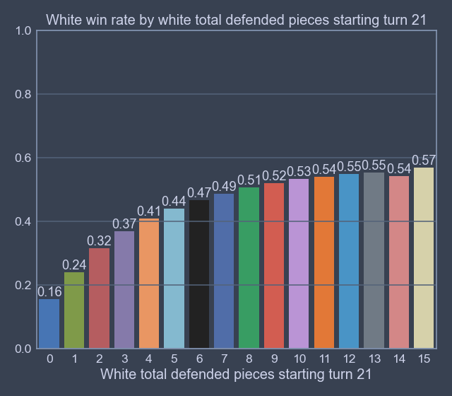

# Predicting the Winner of a Chess Game in the Middlegame

## Table of Contents

<ul>
	<li>[Overview (link)](#Overview)</li>
	<li>[Data (link)](#Data)</li>
	<li>[Models (link)](#Models)</li>
	<li>[Results (link)](#Results)</li>
</ul>

## Overview

This project builds models to predict the winner of a game of chess. The models make this prediction during a period called the "middlegame," a point after the "opening" in which a player has already completed all of their earlygame setup and development. Players have begun forming their own plans on forming attacks and defending against attacks at this point, and likely some pieces have been taken. At this point, the game is likely quite different from any game theyve played before as the number of possible board states after so many moves is tremendous. 

These models predict the winner after the 20th turn has been played. This is a point early enough that it is not obvious who will win the game (as predicting the winner when one player has a large advantage in number of pieces, etc. would not be a very useful model), but late enough that quality information could be gleaned from the game to predict a winner. As a rule of thumb, an average chess game has 40 turns. The models are trained on millions of games played with at least 25 turns played on the open-source chess website [Lichess.org (link)](https://lichess.org/). 

First, data is extracted from the Lichess database and features are created. This data is then briefly analyzed to find trends and correlations. A logistic regression (using sklearn) and a boosted-trees model (using XGBoost) are fit to the data. Finally, performance of the models is analyzed.

The models achieve an accuracy of approximately 69% when incorporating game metadata into the model (such as player ratings and total time per player), and approximately 63% accuracy when strictly using information from the chess game. This is compared to a baseline model which exclusively predicts the winner as the player with the higher rating with approximately 64% accuracy.

### Keywords

data mining, feature engineering, classification, logistic regression, XGBoost

## Preliminary terms

<ul>
	<li>White: common shorthand for "the player with the white pieces." White always moves first.</li>
	<li>Black: common shorthand for "the player with the black pieces."</li>
	<li>Elo/Rating: A number assigned to each player giving an indication of skill. The [Elo rating system (link)](https://en.wikipedia.org/wiki/Elo_rating_system) is a comparative rating system where a higher number indicates better previous performance. Ratings typically range from approximately 100 to 3000 but can be any positive integer. A player gains rating points when they win and lose rating points when they lose. The actual systems used are more complicated than the original Elo system but the monicker "Elo" remains in use colloquially.</li>
	<li>Check: When the king is attacked, and the checked player must move the king or move a piece to block the check.<li>
	<li>Castling: A move in which the king travels left or right two squares while the rook is placed adjacent to the king on the opposite side. The king and rook cannot have moved yet, there cannot be any pieces between the king and rook, and the king cannot castle into, out of, or through (where an opponent's piece is attacking the square between the kings origin and destination) check.</li>
	<li>Decisive game: A game which ended in a victory for either player, not a draw.</li>
	<li>Square notation: Squares are listed by a letter for their column (called the "file") and a number for their row (called the "rank"), such as "a1" or "e4". 
</ul>

## Data


The data comes from the open-source [Lichess database (link)](https://database.lichess.org/). In particular, the games contain all decisive rated games with at least 25 turns played from May, 2016, a total of 3,825,377 games. The games are represented in "Portable Game Notation" (PGN) format, a standard record of chess games. One PGN is stored as follows. 

```
[Event "Rated Blitz game"]
[Site "https://lichess.org/PwE2cWn3"]
[Date "????.??.??"]
[Round "?"]
[White "Mescalero25"]
[Black "fialho"]
[Result "1-0"]
[BlackElo "2124"]
[BlackRatingDiff "-13"]
[ECO "C00"]
[Opening "French Defense: King's Indian Attack"]
[Termination "Normal"]
[TimeControl "300+0"]
[UTCDate "2016.02.29"]
[UTCTime "23:00:02"]
[WhiteElo "2044"]
[WhiteRatingDiff "+17"]

1. e4 e6 
2. d3 d5 
3. Nd2 dxe4 
4. Nxe4 b6 
5. g3 Bb7 
6. Bg2 Be7 
7. Nf6+ Bxf6 
8. Bxb7 Nd7 
9. Bxa8 Qxa8 
10. Qf3 c6 
...
```

This gives information on the metadata of the game including date and time played, player usernames, the rating of each player, the result of the game (where "1-0" indicates white wins, "0-1" indicates black wins, and "1/2-1/2" indicates a draw), and more.

Also included, of course, is the move played on each player's turn with white listed first. These moves are listed in [algebraic notation (link)](https://en.wikipedia.org/wiki/Algebraic_notation_(chess)). 

### Feature engineering

The information which can be gleaned from the metadata is quite apparent. Certain values such as the date, names of the players, etc. can be safely discarded. We save the ratings of the two players.

The bigger challenge is collecting meaningful information from the moves played, without completely overloading the models. One might assume you could simply record the board state information, the location of all pieces on board, and train the models based on the result of the game. For example, if after turn 20 white has a queen on h4, a rook on h8, a knight on f5, etc. and white wins the game. However, because there are an enormous amount of possible board states, more than the number of atoms in the universe (called the [Shannon number (link)](https://en.wikipedia.org/wiki/Shannon_number)), there is far too much possible information to create a meaningful, generalizable model.

We extract information which could, instead, describe a large number of board states while contributing to an accurate prediction of which player is likely to win. The data extracted from these games is listed in the following table, where {COLOR} indicates data is collected separately for white and black.


| Column Name | Column Description | Column Value Type |
|---|---|---|
| total moves | Total moves played in the game (with two moves per turn) | Integer >= 40 |
| time control | Descriptor of total time alloted per player | {"classical", "rapid", "blitz", "bullet", "ultrabullet"} |
| white win  | Whether white or black won the game  | Boolean |
| {COLOR} elo | {COLOR}'s elo | Positive integer |
| {COLOR} castles | Direction {COLOR} castles  | {"kingside", "queenside", NA} |
| {COLOR} total left wing pawn moves | Total pawn moves in {a,b,c} files by {COLOR} | Nonnegative integer |
| {COLOR} total center pawn moves | Total pawn moves in {e,d} files by {COLOR} | Nonnegative integer |
| {COLOR} total right wing pawn moves | Total pawn moves in {d,f,g} files by {COLOR} | Nonnegative integer |
| {COLOR} total knight moves | Total times {COLOR} moved a knight | Nonnegative integer |
| {COLOR} total bishop moves | Total times {COLOR} moved a bishop | Nonnegative integer |
| {COLOR} total rook moves | Total times {COLOR} moved a rook | Nonnegative integer |
| {COLOR} total queen moves | Total times {COLOR} moved a queen | Nonnegative integer |
| {COLOR} total king moves | Total times {COLOR} moved their king | Nonnegative integer |
| {COLOR} total doubled pawn files | Total files which have 2+ {COLOR} pawns | Nonnegative integer |
| {COLOR} total no pawn files | Total files which have 0 {COLOR} pawns | Nonnegative integer |
| {COLOR} total isolated pawn files | Total files which have 1+ {COLOR} pawns with no pawns on adjacent files | Nonnegative integer |
| {COLOR} total pawns | Total {COLOR} pawns | Nonnegative integer |
| {COLOR} total knights | Total {COLOR} knights | Nonnegative integer |
| {COLOR} total bishops | Total {COLOR} bishops | Nonnegative integer |
| {COLOR} total rooks | Total {COLOR} rooks | Nonnegative integer |
| {COLOR} total queens | Total {COLOR} queens | Nonnegative integer |
| {COLOR} total attacked squares | Total squares {COLOR} on which could move or capture a piece  | Nonnegative integer |
| {COLOR} total attacked pieces | Total {OPPONENT_COLOR} pieces attacked by {COLOR} pieces | Nonnegative integer |
| {COLOR} total defended pieces | Total {COLOR} pieces "attacked" by {COLOR} pieces | Nonnegative integer |
| {COLOR} total hanging pawns | Total {COLOR} undefended pawns attacked by {OPPONENT_COLOR} pieces | Nonnegative integer |
| {COLOR} total hanging pieces | Total {COLOR} undefended non-pawn pieces attacked by {OPPONENT_COLOR} pieces | Nonnegative integer |
| {COLOR} furthest pawn | Rank furthest from {COLOR}'s starting pawn rank which contain's a {COLOR} pawn | Nonnegative integer in (2,7) |
| {COLOR} total king blockers | Total {COLOR} pieces adjacent to {COLOR}'s king | Nonnegative integer |

#### Feature rationales

The features "{COLOR} total {PIECE}s" are fairly obvious -- a player having more pieces can attack more strongly and defend more easily. Data is collected per piece for more granularity. A queen is more useful than a rook, rooks are considered more useful than knights or bishops, etc.

The features "{COLOR} total {NON-PAWN PIECE} moves" are collected because of a general rule of thumb -- it is good to move all of your non-pawn pieces at least once so they are "active" and can attack or defend more relevant squares. However, moving the same pieces repeatedly can be considered a waste of a move if little is accomplished. A more efficient attack would involve attacking with many pieces.

The features "{COLOR} total {LEFT WING/RIGHT/WING} pawn moves" are collected for another few rule of thumbs. Pawns are effective ways to control the board as they can attack non-pawn pieces efficiently. However, moving too many pawns can create permanent weaknesses because they cannot move backwards. The pawn moves are split into left wing, center, and right wing (from the perspective of white) because of the relation to castling. Moving pawns in front of your king is very weakening and invites getting checked, but moving pawns toward the opponents king can form very effective attacks.

The features relating to doubled/no/isolated pawn files correlate to potential weaknesses formed from capturing with pawns or pawns getting captured. Doubled pawns are a weakness because they get in the way of each other. Isolated pawns are a weakness because they must be defended by pieces, rather than other pawns, which is inefficient. Files without pawns can be a weakness (as there is no pawn there to threaten the opponent) or a strength (it opens up the way for rooks or queens to control the file). 

"{COLOR} attacked squares" gives an indication of the options available to {COLOR}. More possible moves to make is likely correlated with being on the attack, while fewer moves indicates that your pieces are in a defensive position or blocked off by opponent pieces. Similarly "{COLOR} attacked pieces" gives an indication of your options in attacking the opponent. "{COLOR} defended pieces" is the converse of this, how well you can defend against an attack. "{COLOR} hanging pieces" gives an indication of how well a player is defending. If many pieces are being attacked without being defended, you are likely to soon lose them, putting you at a disadvantage.

"{COLOR} furthest pawn" gives some indication of which player is on the attack. If one player is invading the opponent's side of the board with their pawns or is about to promote their pawn, that player is likely generating significant threats to the opponent.

Finally, "{COLOR} king blockers" gives an indication of king safety. If the opponent cannot put you in check because you have pieces surrounding your king, you don't ever need to waste a move getting out of check.

### Visualization and analysis

The following plots show the total games per number of moves and total games per absolute rating difference. Recall that there are 2 moves per turn. We see the expected trend of longer games occuring less frequently, and players with a large rating gap being paired less frequently. Players are typically paired through "quick play" where the system matches up players for a single game, or through a tournament where players get paired with other players with similar tournament performance, which correlates with rating. The jump in games at 250 rating point difference is simply caused by larger buckets.

 


The following plot shows white's win rate by rating difference, defined as "white elo" minus "black elo." We see the expected trend of a larger gap indicating a higher win rate. 90% win rate when 400 rating points above an opponent is how the Elo system defines a rating gap, so the more complex system used by Lichess (Glicko2) must also be defined this way, or similarly.

 

The following plots show white's win rate before white makes their 21st move, by "white total attacked squares," "white total attacked pieces," and "white total defended pieces." We see that "white total attacked squares" correlates very strongly with white winning the game. This gives a strong indication that "space," the ability to move to a large number of squares, is an important factor in an advantage in a chess game. White's win rate also increases with "white total attacked pieces," though less dramatically. Attacking more of your opponents pieces puts pressure on your opponent to defend well, while leaving less room for attack. The low win rate for 10 pieces is due to outliers, there are only 14 games in all of the several million games in which white attacks 10 pieces after move 20. White's win rate versus "white total defended pieces" flattens out, showing that its not necessarily important to defend all of your pieces if they will not be under any relevant threat soon. 




The following plots show white's win rate before white makes their 21st move, by "white total hanging pieces" and "black total hanging pieces." "white total hanging pieces" has less correlation with white win rate. However, "black total hanging pieces" has a stronger correlation with white's win rate. This is likely caused by the inherent disparity between the colors when recording at one point in time. If black has just made a move and has pieces hanging, white can immediately take advantage and take them. However if black just made a move and white still has pieces hanging, white has a chance to salvage them.


The following plot shows white's win rate before white makes their 21st move, by material difference, a single number indicating the effectiveness of a player's remaining pieces. Material "points" are defined as a weighted sum of remaining pieces left on board for each side. Each side's material points are defined as (number of pawns) + 3\*(number of knights) + 3\*(number of bishops) + 5\*(number of rooks) + 9\*(number of queens). Material difference is defined as white's material points minus black's material points. We see the importance of having more pieces than your opponent to win the game.


## Models 

We compare two logistic regression models and two XGBoost boosted-trees models against a baseline model. 

We train one logistic regression model and one XGBoost model on all of the available data except "total moves" and "white win." These models incorporate all collected data available a player up through black's 20th move. These models are called LR1 and XGB1, respectively.

We additionally train one logistic regression model and one XGBoost model on all of the available data except "total moves," "white win," "white elo," "black elo," and "time control." These models only incorporate game history and board state information. These models are called LR2 and XGB2, respectively.

After training the models, we explore their performance in the following section [Results](#Results).

### Preparing data for modeling

We one-hot encode the features "time control," "white castles," and "black castles." We encode "white elo" and "black elo" as "rating_diff", by subtracting "black elo" from "white elo." We replace the raw elo values with a difference because the rating system is intended to be used comparatively. A higher rating might correlate with better play in general, but the opponent's relative ability to capitalize on poor play is the critical factor.

We split the data into 80% training data, 20% test data.

### Baseline model

We include a baseline model, simply predicting the winner as the player with the higher rating, with a tie going to white. This model is fairly accurate, giving approximately 65% accurate predictions overall. This model is quite powerful for a baseline model as the rating of each player incorporates a history of performance and is already an indicator of which player is likely to win.

### Logistic Regression Model

We use logistic regression models from sklearn with max_iter=1000, penalty="elasticnet", solver="saga", l1_ratio=0.1.

### XGBoost Model

We use boosted-trees models from XGBoost with n_estimators=1000, early_stopping_rounds=15, with 60% of the total data for training, and 20% of the total data for validation (necessary for early stopping). The model incorporating metadata such as player ratings had the best iteration of 160, while the model only using game history information had the best iteration of 176.

## Results

We use accuracy, precision, recall, f1-score, and area under ROC curve to assess performance.

| Model | Accuracy | Precision | Recall | F1 | ROC AUC |
|---|---|---|---|---|---|---|
| Baseline | 0.6486 | 0.6502 | 0.6464 | 0.6483 | NA |
| XGB1 | 0.6904 | 0.6912 | 0.6916 | 0.6914 | 0.7644 |
| XGB2 | 0.6365 | 0.6380 | 0.6363 | 0.6372 | 0.6949 |
| LR1 | 0.6875 | 0.6878 | 0.6902 | 0.6890 | 0.7596 |
| LR2 | 0.6328 | 0.6327 | 0.6385 | 0.6356 | 0.6892 |

The baseline sits in between the models which use metadata and models which don't. The models using the metadata and game information would be expected to perform better than the models which don't use either. 

I expected the XGB models to perform better than the logistic regresion models as they can include arbitrarily many trees to make decisions, but there seems to be a fairly hard limit on the accuracy and they use fairly low amounts of trees.

The models which only use board state information to an impressive job of nearly matching the baseline model. As discussed above, the baseline model includes very powerful rating metrics which themselves are designed specifically to give information on who will likely win the game. 

The addition of the metadata gives only a small boost to performance of apprixmately 5.5% accuracy for both the LR and XGB models. This shows both that the rating is a very strong predictor and that predicting the winner the middlegame is a task filled with uncertainty and randomness.

The following plots show the accuracy of the models by absolute rating difference. We can see the baseline model has a smooth increase in accuracy as the rating difference between the players grows, which is expected. The XGB1 and LR1 models are slightly flatter, showing their primary increases in accuracy are due to more accurate predictions at smaller rating differences. This is obviously caused by the increased information available to the model. The XGB2 and LR2 models are even flatter, having nearly no correlation with rating, which is expected as they do not use the rating information. There is a slight increase in accuracy of the XGB2 and LR2 models when the rating difference is very large, likely because the greater skill of the higher rated player would show itself more strongly on the board after move 20.


The following plots show the accuracy of the models by total moves of the game. Recall that there are two moves per turn. All models decrease in performance as the total moves of the games grow, which is expected as we make a prediction after the 20th move, and there is a large chance for blunders and swings in advantage as the game goes longer and longer.


The following plots show the accuracy of the models by absolute material difference, defined in section [Data (link)](#Data). All models improved in performance as absolute material difference grew. The baseline model was the weakest in this regard as it only relies upon the stronger players having better material difference after move 20, rather than actually using piece information on board to make a prediction. In this metric, the XGB1/XGB2 and LR1/LR2 are essentially identical. The models which use rating are more accurate for small values of material difference, as they trust the higher rated player will convert the small advantage to a large one, or come back from a material deficit.


